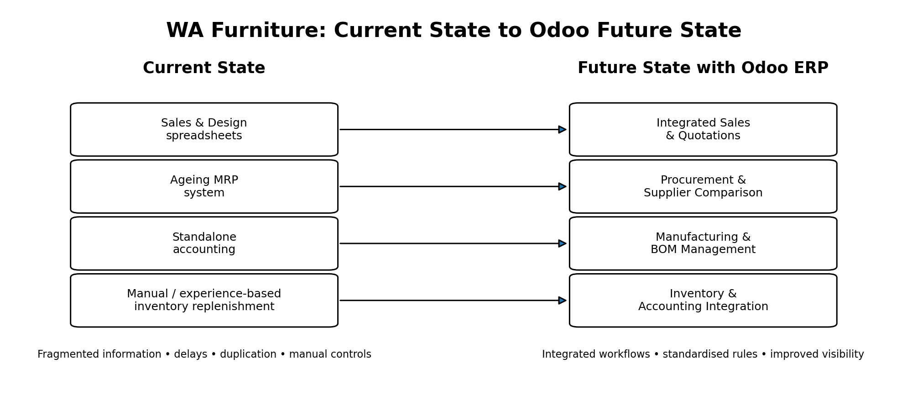
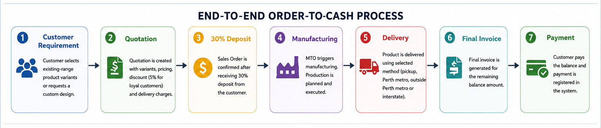
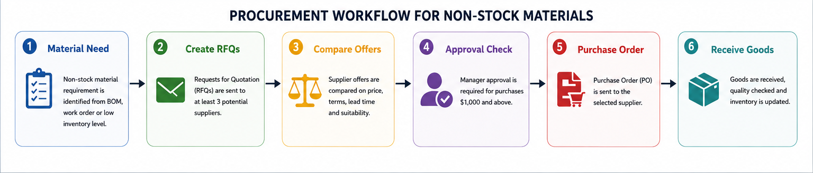
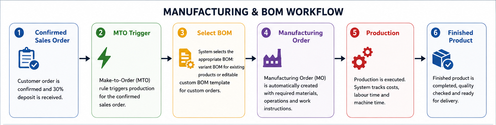

# Odoo ERP Business Process Analysis & Configuration

## Project Overview
University portfolio case study showing how functional requirements for a fictional Perth make-to-order furniture manufacturer were translated into an integrated Odoo ERP configuration across Sales, Procurement, Manufacturing, Inventory Management and Accounting.

## Business Problem
WA Furniture relied on spreadsheets, an ageing MRP system, a standalone accounting package and paper-based information exchange. The case highlighted errors and misplaced information, payment and invoice delays, difficult custom-product costing, inefficient supplier comparison, duplicate BOMs and experience-based inventory replenishment.

## Functional Scope
- **Sales:** product variants, custom quotations, loyal-customer discounts, delivery pricing and 30% deposits
- **Procurement:** multi-supplier RFQs, preferred suppliers and approval for purchases of $1,000+
- **Manufacturing:** sales-triggered manufacturing orders, variant BOMs, custom BOM templates and cost/time tracking
- **Inventory:** automated replenishment through reordering rules
- **Accounting:** invoicing and payment processing

## Business Analysis Approach
1. Reviewed current-state business and IT problems.
2. Analysed functional requirements across five business functions.
3. Mapped requirements to relevant Odoo functionality.
4. Configured connected ERP processes.
5. Validated the documented configuration against the stated requirements.

## Business Value
The proposed solution demonstrates how an integrated ERP can reduce reliance on fragmented information, standardise business rules, strengthen purchasing controls, improve BOM management, automate replenishment and improve cross-functional visibility.

## Skills Demonstrated
Business Analysis · Functional Requirements · Requirements-to-System Mapping · Process Analysis · Odoo ERP · ERP Configuration · Procurement · Inventory · Manufacturing/MRP · BOM Management · Sales & Order Management · Testing & Validation · Process Documentation

## Repository Structure
```text
odoo-erp-business-process-analysis/
├── README.md
├── images/
├── requirements/functional-requirements.md
├── process-maps/README.md
├── testing/validation-matrix.md
└── documentation/
    ├── business-case.md
    └── configuration-summary.md
```

## Project Context
Completed as university coursework using a fictional business scenario and reorganised as a portfolio case study. No quantified performance improvement is claimed because the supplied project documents do not establish one.


## Process Diagrams

### Current State to Future State



*Portfolio diagram showing how the case moves from disconnected spreadsheets and standalone systems toward an integrated Odoo ERP environment.*

### Order-to-Cash Process



*End-to-end flow from customer requirements and quotation through deposit, manufacturing, delivery, final invoicing and payment.*

### Procurement Workflow



*Procurement process for non-stock materials, including multi-supplier RFQs, comparison, approval controls and goods receipt.*

### Manufacturing & BOM Workflow



*Flow from confirmed sales order through make-to-order manufacturing, BOM selection, production and finished goods.*

## Requirements Traceability

See [`analysis/requirements-traceability-matrix.md`](analysis/requirements-traceability-matrix.md) for the mapping between business requirements, business problems, Odoo configuration and expected business value.

> These diagrams were recreated for portfolio presentation from the original university case requirements and configuration report. They are not screenshots from the original Odoo demo environment.
